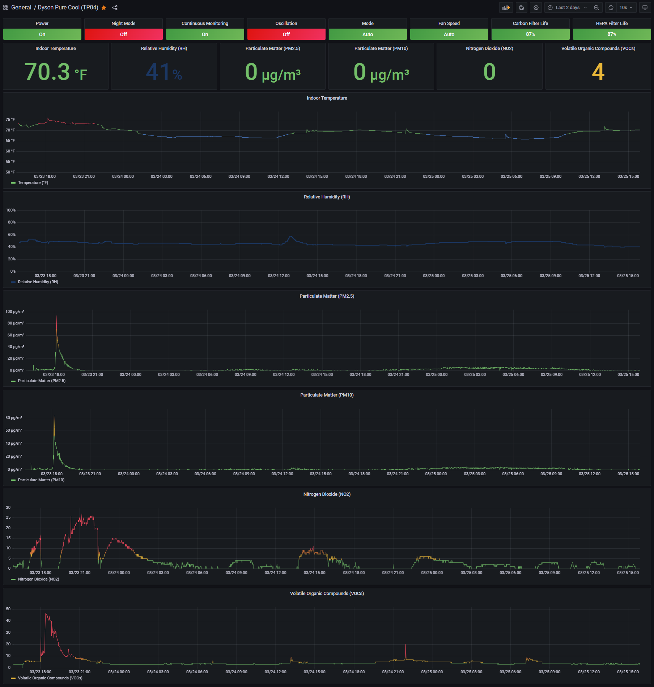

# Promethus Exporter for Dyson Fans

Inspired by [Prometheus PVE Exporter](https://github.com/prometheus-pve/prometheus-pve-exporter) and [Dyson Graph](https://github.com/williampiv/dyson-graph), leveraging [Libdyson](https://github.com/shenxn/libdyson) for the API.

---

Github URL: https://github.com/zkhcohen/prometheus-dyson-exporter

Docker Hub URL: https://hub.docker.com/r/zkhcohen/prometheus-dyson-exporter

Grafana Dashboards URL: https://grafana.com/grafana/dashboards/15958

---

### Installation Instructions:
1. Clone [Libdyson](https://github.com/shenxn/libdyson).
2. Run [get_devices.py](https://github.com/shenxn/libdyson/blob/main/get_devices.py) on the CLI in order to print out credentials for your Dyson device.
3. Either create a devices.ini file containing the device information (example below), or pass the variables as environment variables via a docker-compose.yml file or on the CLI.
4. Install the [Grafana dashboard](https://grafana.com/grafana/dashboards/15958).

---
## Example docker-compose.yml file (using devices.ini config file):
```
---
version: "3.8"
services:
  prometheus-dyson-exporter:
    image: zkhcohen/prometheus-dyson-exporter:latest
    container_name: prometheus-dyson-exporter
    ports:
      - "9672:9672"
    volumes:
      - "./devices.ini:/config/devices.ini"
    environment:
      EXPORTER_PORT: "9672"
      EXPORTER_LOG_LEVEL: "INFO"
      CONFIG_PATH: "/config/devices.ini"
    restart: always
```

## Example devices.ini config file:
```
[My Dyson Air Purifier]
dyson_serial = F4P-US-PT338B32
dyson_credential = ajds3AS+FPsidcQ8VxNmfJXHqFFNoBLaCaWRQTeTMnwVPhsH6rocz8UJ2puatCpszzvaQwYYL3mnsCqEgAGgc9X==
dyson_device_type = 438
dyson_ip = 10.0.10.2
```
---
## Example docker-compose.yml file (using environment variables):
```
---
version: "3.8"
services:
  prometheus-dyson-exporter:
    image: zkhcohen/prometheus-dyson-exporter:latest
    container_name: prometheus-dyson-exporter
    ports:
      - "9672:9672"
    environment:
      EXPORTER_PORT: "9672"
      EXPORTER_LOG_LEVEL: "INFO"
      CONFIG_PATH: "/config/devices.ini"
      DYSON_SERIAL: "F4P-US-PT338B32"
      DYSON_CREDENTIAL: "ajds3AS+FPsidcQ8VxNmfJXHqFFNoBLaCaWRQTeTMnwVPhsH6rocz8UJ2puatCpszzvaQwYYL3mnsCqEgAGgc9X=="
      DYSON_DEVICE_TYPE: "438"
      DYSON_IP: "10.0.10.2"
    restart: always
```
---
## Example Grafana Dashboard


